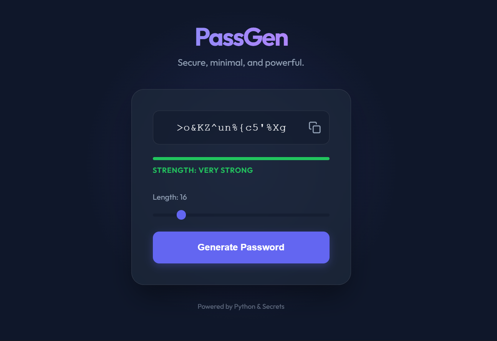

# PassGen - Premium Python Password Generator

PassGen is a sleek, modern, and cryptographically secure password generator built with **Python (Flask)** and **Vanilla CSS**. It features a minimal UI with glassmorphism aesthetics and real-time strength analysis.



## ✨ Features

- **Secure Generation**: Uses Python's `secrets` module for high-entropy, cryptographically strong passwords.
- **Strength Analysis**: Real-time feedback on password complexity (Weak to Very Strong).
- **Premium Design**: Dark mode interface with glassmorphism effects and smooth transitions.
- **Customizable**: Adjustable password length (8-64 characters).
- **Instant Copy**: One-click functionality to copy the generated password to your clipboard.

## 🚀 Getting Started

### Prerequisites

- Python 3.x
- Flask

### Installation

1. **Clone the repository** (or copy the files):
   ```bash
   git clone https://github.com/AdityaAK7/Password-generator.git
   cd python-project
   ```

2. **Install dependencies**:
   ```bash
   pip install flask
   ```

3. **Run the application**:
   ```bash
   python app.py
   ```

4. **Open in your browser**:
   Navigate to [http://127.0.0.1:5000](http://127.0.0.1:5000)

## 🛠️ Technology Stack

- **Backend**: Python (Flask)
- **Frontend**: HTML5, Vanilla CSS (Modern CSS variables, Flexbox, Animations), Vanilla JavaScript
- **Typography**: Outfit (Google Fonts)
- **Security**: Python `secrets` library

## 📄 License

This project is open-source and available under the [MIT License](LICENSE).
